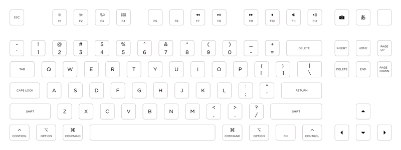
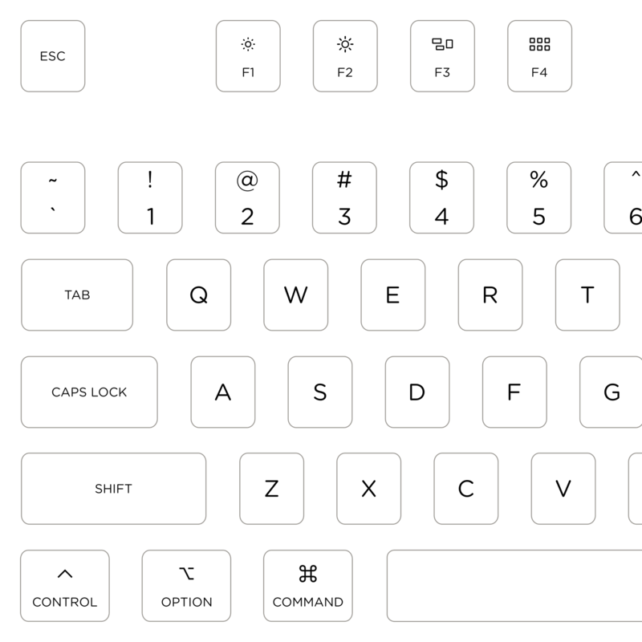
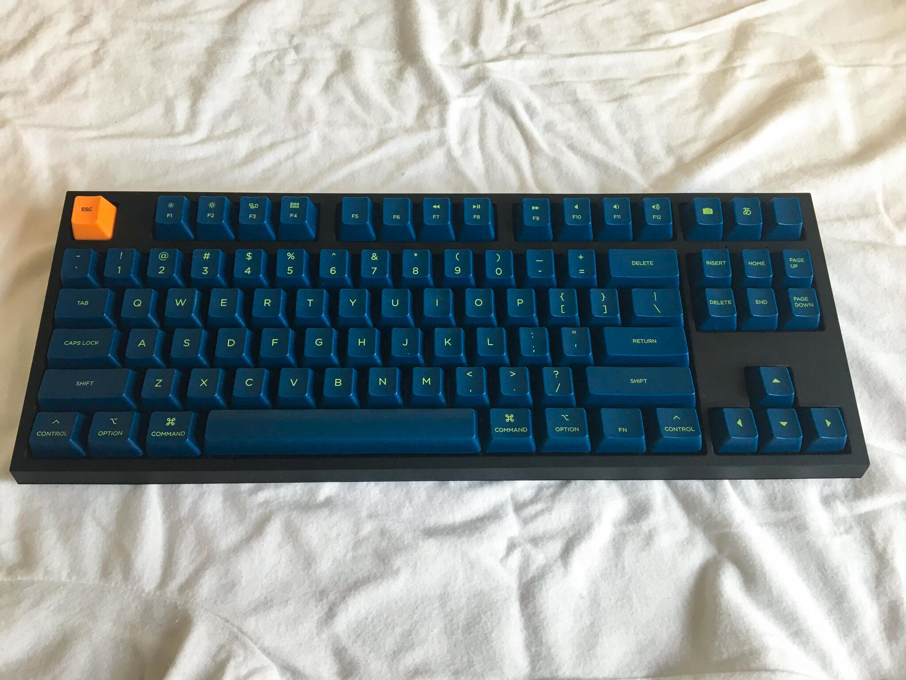
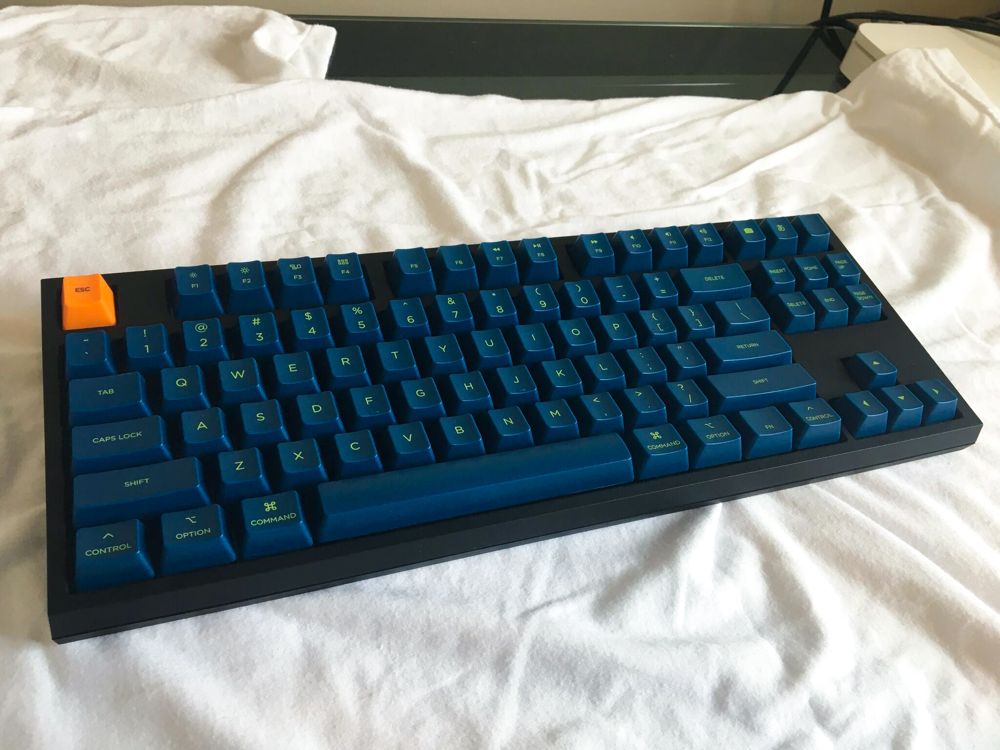
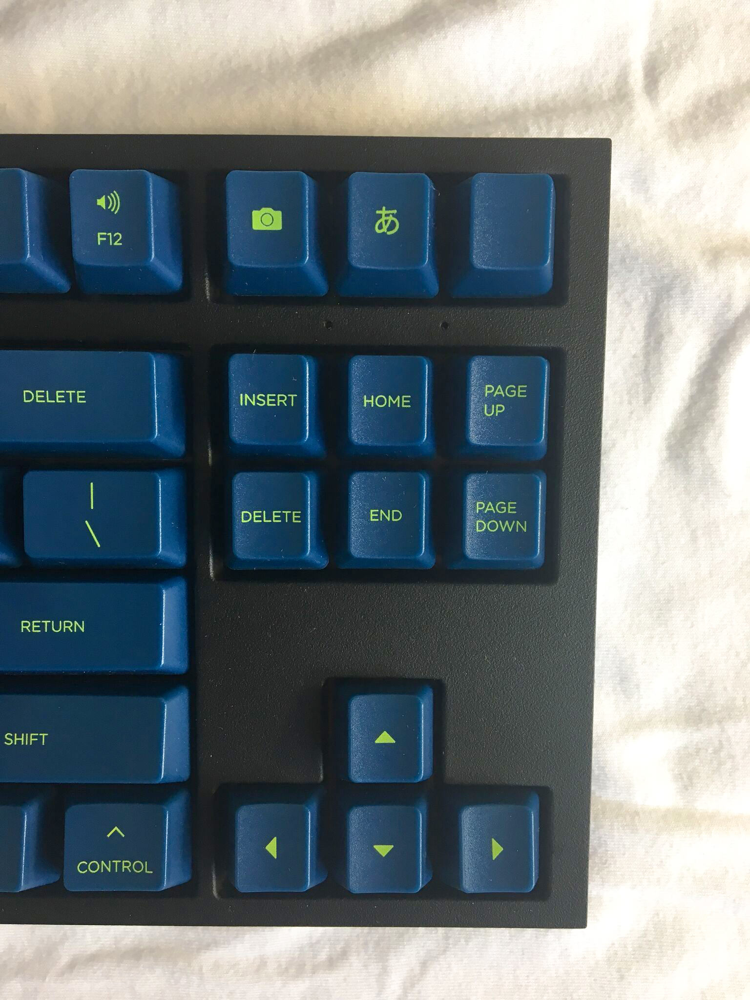

# Gotham Keycaps

This is a layout for custom keycap legends for a [WASD v2 87-key mechanical keyboard][wasd].

## Description

I was inspired to create my own keycaps after seeing [this Apple Extended Keyboard II layout][aek]. My layout is set in Gotham Rounded and features standard Mac modifier keys.

The F13, F14, and F15 keys (Print Screen, Scroll Lock, and Break) have been replaced with two icons and a blank key. F13 has a camera icon to represent screen shots, but in practice I actually prefer command-shift-3 and command-shift-4. I use F14 to switch the input mode between U.S. and Japanese.

## Usage

If you want to use this layout for your own custom keyboard there are 2 files to choose from:

1. [gotham-keycaps-path.svg][svg-path]: This file has been converted to paths and is ready to be uploaded to WASD as-is. You can make changes, but the text is not editable.
2. [gotham-keycaps-text.svg][svg-text]: This file has editable text. To use it you will need a copy of Gotham Rounded Book, which you can [purchase from Hoefler & Co.][gotham]. Before uploading, make sure you convert all text to paths.

To get the function keys and the Fn key working correctly, you'll need to set up [Karabiner][karabiner]. The Fn key needs to be mapped from the PC "application" key.

## Photos

## Credits

[Camera][camera] icon by Landan Lloyd from [the Noun Project][noun-project].

[svg-path]: gotham-keycaps-path.svg
[svg-text]: gotham-keycaps-text.svg
[gotham]: https://www.typography.com/fonts/gotham-rounded/overview/
[camera]: https://thenounproject.com/term/camera/1397265
[noun-project]: http://thenounproject.com/
[wasd]: http://www.wasdkeyboards.com/index.php/products/mechanical-keyboard/wasd-v2-87-key-custom-mechanical-keyboard.html
[karabiner]: https://pqrs.org/osx/karabiner/
[aek]: https://github.com/getclacking/aek-ii-keycap-project
